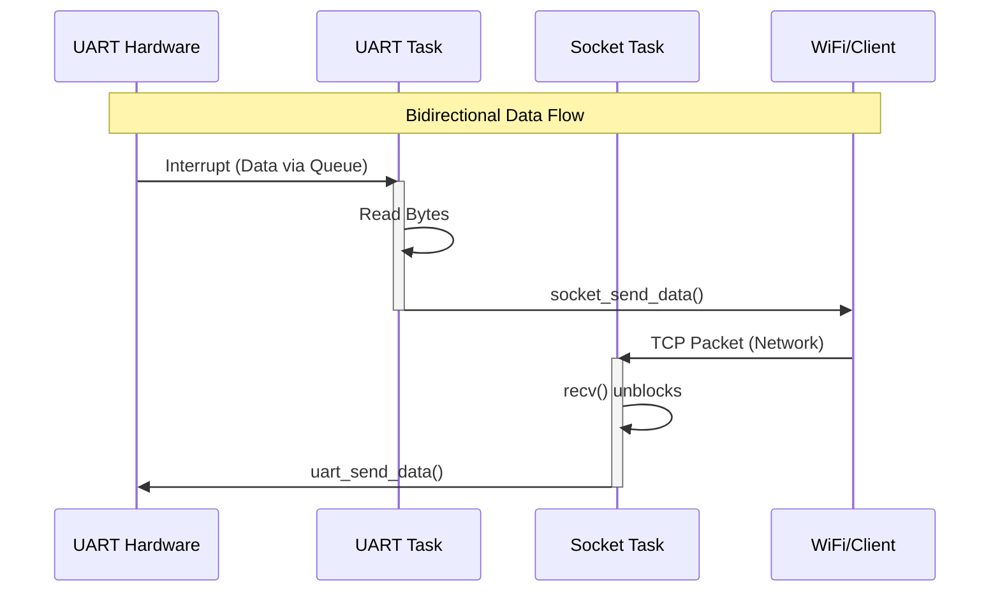

# FreeRTOS Implementation Documentation
**Project:** ESP32 Serial-WiFi Bridge  
**Framework:** ESP-IDF (FreeRTOS v10.x SMP)

## 1. Overview
This project leverages **FreeRTOS** (Real-Time Operating System) to manage concurrent operations on the ESP32-S3. Unlike a traditional "Super Loop" architecture, FreeRTOS allows the UART communication and WiFi networking to operate independently and asynchronously without blocking each other.

## 2. System Architecture

### 2.1 Scheduler & Multitasking
The system uses a **Preemptive Scheduler**. The scheduler divides CPU time into "ticks" (configured typically at 10ms or 1ms). Tasks are assigned priorities, and the scheduler ensures the highest priority task ready to run gets CPU time.

- **Tick Rate:** Default (100Hz or 1000Hz)
- **Core Affinity:** Tasks are pinned to **Core 0** in this project to simulate a single-core environment and avoid race conditions, though FreeRTOS handles multicore transparently.

### 2.2 Task Breakdown

The application is divided into three primary concurrent tasks:

| Task Name | Priority | Stack Size | Function | Responsibility |
| :--- | :--- | :--- | :--- | :--- |
| `uart_event_task` | 2 (Medium) | 4096 B | `uart_app.c` | **UART Receiver**: Blocks waiting for hardware interrupts. When data arrives, it reads the UART FIFO and attempts to send it to the TCP socket. |
| `tcp_server_task` | 2 (Medium) | 4096 B | `socket_server.c` | **TCP Server**: Manages the socket lifecycle (Listen/Accept). Blocks on `recv()` waiting for network packets. When a packet arrives, it writes data to the UART driver. |
| `wifi_event_handler` | System | N/A | `wifi_app.c` | **WiFi Management**: Runs in the context of the system/IP task. Handles asynchronous events like `WIFI_CONNECTED` or `IP_EVENT_STA_GOT_IP` to trigger application state changes. |

## 3. Inter-Process Communication (IPC)

Efficient and safe communication between tasks is achieved using the following mechanisms:

### 3.1 Queues
- **`uart_event_queue`**: A FreeRTOS Queue is used by the ESP-IDF UART driver to signal the `uart_event_task`.
    - *Publisher (ISR)*: The UART Hardware Interrupt Service Routine (ISR) pushes an event (e.g., `UART_DATA`, `UART_BUFFER_FULL`) into this queue.
    - *Subscriber (Task)*: The `uart_event_task` sleeps on `xQueueReceive()`. It only wakes up when the ISR signals that data is ready, ensuring 0% CPU usage during idle times.

### 3.2 Sockets (LwIP integration)
- The LwIP (Lightweight IP) stack runs as a high-priority background task.
- When `tcp_server_task` calls `recv()`, it effectively blocks on an internal semaphore/mailbox.
- When a WiFi packet arrives, the WiFi Driver transfers it to LwIP, which then "posts" the data to the socket, waking up the `tcp_server_task`.

## 4. WorkFlow Diagram

## 5. Why FreeRTOS?
1.  **Responsiveness**: High-priority events (like a full UART buffer) are handled immediately, pre-empting lower priority work.
2.  **Modularity**: The UART logic doesn't need to know details about WiFi logic. They just pass data.
3.  **Power Efficiency**: When no data is moving, both tasks are in the `Blocked` state, allowing the Idle Task to put the CPU into low-power modes.
